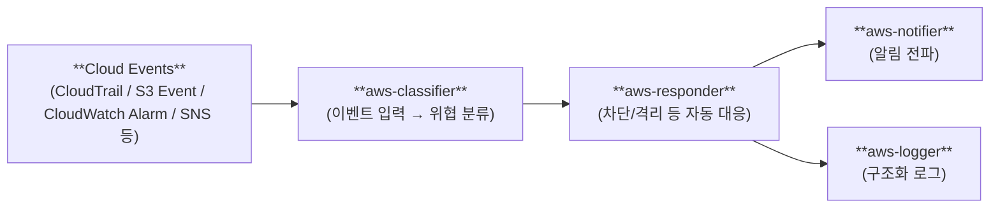

# aws-security-pipeline

## Overview

- AWS 보안 자동화를 위해 필요한 기능을 **컴포넌트화**하고, 디렉토리 단위로 분리한 **이벤트 기반 모듈형 침해 탐지·대응 파이프라인**입니다.
- 파이프라인 흐름: **Classifier → Responder → Notifier → Logger**
- 신규 위협(탐지 로직) 추가 시 **Classifier 확장** 중심으로 변경 비용을 최소화하도록 설계했습니다.

## Background

- 아키텍처 설계 단계에서 보안 요구사항을 강제하지 못하면 설정 누락 리스크가 발생할 수 있습니다.
- 서비스별로 개별 배포되는 구조에서는 네트워크 분리, 접근 제어, 로그 수집 방식이 일관되지 않기 쉽습니다.
- 보안 아키텍처와 코드 구조에 대한 기준이 없으면 신규 서비스/보안 기능 확장 시 비효율이 커집니다.

## Architecture



## Components

| Directory | Role | Description |
| --- | --- | --- |
| `aws-classifier/` | Detect | 이벤트 입력을 기준으로 위협을 분류하고, 필요 시 대응/알림/기록 모듈을 호출합니다. |
| `aws-responder/` | Respond | 분류 결과에 따라 차단·격리(예: Access Key 비활성화, 정책 제한, 인스턴스 종료 등) 작업을 수행합니다. |
| `aws-notifier/` | Notify | 탐지/대응 이벤트를 사람이 확인할 수 있도록 SNS 기반 이메일 알림을 전송합니다. |
| `aws-logger/` | Log | 이벤트 필드를 정규화해 **일관된 포맷의 구조화 로그**를 남깁니다. |

각 컴포넌트 및 하위 모듈은 독립적으로 배포·운영할 수 있으며, 상세 동작/설정/테스트 방법은 각 디렉토리의 `README.md`를 참고하세요.

## Tech Stack

- AWS Lambda (Python 3.9)
- Boto3
- CloudTrail
- CloudWatch (Logs / Logs Insights / Alarm)
- S3 (이벤트 트리거 및 데이터 저장)
- SNS (알림 전송)
- IAM / EC2 (자동 대응 대상 리소스)

## Directory Structure

```bash
aws-security-pipeline/
├── aws-classifier/     # Threat classification modules
├── aws-responder/      # Automated response actions
├── aws-notifier/       # Alerting (SNS email)
├── aws-logger/         # Structured security logging
└── README.md
```

## How It Works

- **Event Ingestion**: CloudTrail, S3 이벤트, CloudWatch Alarm/SNS 등 다양한 이벤트 소스가 입력으로 들어옵니다.
- **Classification (aws-classifier)**: 이벤트의 핵심 필드(예: IP, 사용자, 이벤트 타입)를 기반으로 위협 여부/유형을 분류합니다.
- **Response (aws-responder)**: 위협으로 판정되면 대응 모듈이 실행되어 접근 차단/권한 제한/리소스 격리 같은 조치를 수행합니다.
- **Notify & Log**: 운영 가시성을 위해 `aws-notifier`는 알림을 전파하고, `aws-logger`는 공통 포맷으로 로그를 남깁니다.
- **Operational Resilience**: 비동기 처리와 실패 재처리(재시도, DLQ 등)를 적용할 수 있는 구조를 염두에 두고, 각 모듈을 느슨하게 결합했습니다.

## Features / Main Logic

- **Modular, Event-driven Design**
	- 탐지/대응/알림/기록을 디렉토리 단위 컴포넌트로 분리해 재사용성과 확장성을 높였습니다.
- **Classifier 중심 확장**
	- 신규 위협 유형 추가 시 Classifier 모듈(또는 하위 classifier)만 추가/확장하는 것을 기본 경로로 설계했습니다.
- **Consistent Notification & Logging**
	- 알림/로깅은 별도 모듈로 분리해 파이프라인 전체에서 일관된 포맷과 라우팅을 유지합니다.

## Motivation / Impact

- 모듈형 침해 탐지·대응 파이프라인을 구축해 보안 기능 확장의 비용을 낮추고 운영 일관성을 높입니다.
- 대응(Responder)과 알림/기록(Notifier/Logger)을 표준화해, 탐지 소스가 늘어나도 운영 체계가 흔들리지 않도록 합니다.

## Notes

- 이 레포지토리는 **컴포넌트 묶음(monorepo)** 형태이며, 각 컴포넌트는 독립적으로 배포 가능한 Lambda 단위로 구성되어 있습니다.
- 배포/트리거 연결/권한(IAM) 구성은 각 컴포넌트 및 하위 모듈 README를 기준으로 진행하는 것을 권장합니다.
